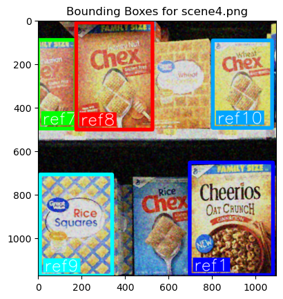
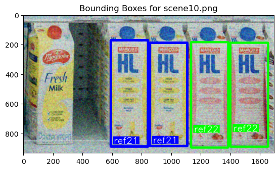

## Image Processing and Computer Vision - Assignment Module 1

This project is part of the Image Processing and Computer Vision course at the University of Bologna (UniBo).
 Computer vision-based object detection techniques can be applied in
super market settings to build a system that can identify products on
store shelves. An example of how this system could be used would be to
assist visually impaired customers or automate common store management
tasks like detecting low-stock or misplaced products, given an image of
a shelf in a store.
### Collaborators
- Habib Kazemi
- Safoura Banihashemi
- Hesam Sheikh Hassani

## Table of Contents
- [Project Description](#project-description)
- [Task](#task)
- [Data](#data)
- [Track A - Single Instance Detection](#track-a---single-instance-detection)
- [Track B - Multiple Instances Detection](#track-b---multiple-instances-detection)
- [Evaluation Criteria](#evaluation-criteria)
- [License](#license)

## Task

Develop a computer vision system that, given a reference image for each
product, is able to identify such product from one picture of a store
shelf.

For each type of product displayed in the shelf the system should
report:

1.  Number of instances;
2.  Dimension of each instance (width and height in pixel of the
    bounding box that enclose them);
3.  Position in the image reference system of each instance (center of
    the bounding box that enclose them).

#### Example of expected output

    Product 0 - 2 instance found:
      Instance 1 {position: (256, 328), width: 57px, height: 80px}
      Instance 2 {position: (311, 328), width: 57px, height: 80px}
    Product 1 – 1 instance found:
    .
    .
    .

### Track A - Single Instance Detection

Develop an object detection system to identify single instance of
products given one reference image for each item and a scene image.

The system should be able to correctly identify all the product in the
shelves image.

### Track B - Multiple Instances Detection

In addition to what achieved at step A, the system should also be able
to detect multiple instances of the same product.

## Data

Two folders of images are provided:

-   **Models**: contains one reference image for each product that the
    system should be able to identify.
-   **Scenes**: contains different shelve pictures to test the developed
    algorithm in different scenarios. The images contained in this
    folder are corrupted by noise.

#### Track A - Single Instance Detection {#track-a---single-instance-detection}

-   **Models**: {ref1.png to ref14.png}.
-   **Scenes**: {scene1.png to scene5.png}.

#### Track B - Multiple Instances Detection {#track-b---multiple-instances-detection}

-   **Models**: {ref15.png to ref27.png}.
-   **Scenes**: {scene6.png to scene12.png}.
## Evaluation criteria

1.  **Procedural correctness**. There are several ways to solve the
    assignment. Design your own sound approach and justify every
    decision you make;

2.  **Clarity and conciseness**. Present your work in a readable way:
    format your code and comment every important step;

3.  **Correctness of results**. Try to solve as many instances as
    possible. You should be able to solve all the instances of the
    assignment, however, a thoroughly justified and sound procedure with
    a lower number of solved instances will be valued **more** than a
    poorly designed approach.

## License
This project is licensed under the MIT License. See the [LICENSE](LICENSE) file for more details.